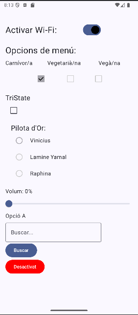
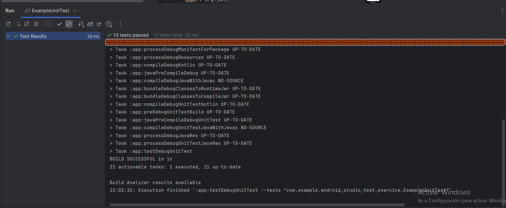
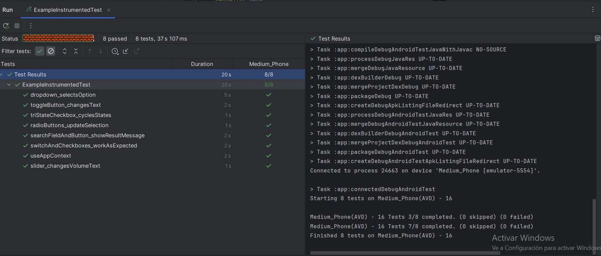

# PR12 Android Testing (UT + UI)

Repositori del lliurament: [pr12-android-testing-XavierFarrus](https://github.com/LSG-0488-25-26/pr12-android-testing-XavierFarrus)

## Objectiu

Completar l'aplicacio Android amb arquitectura MVVM (amb `LiveData`) i implementar:

- Unit Testing per tots els metodes del `MainViewModel`.
- Instrumental UI Testing per tots els composables de `MainView`.

## Arquitectura i implementacio

- Patró utilitzat: MVVM.
- `MainViewModel` gestiona l'estat reactiu de:
  - `Switch`
  - `Checkbox` (carnivor, vegetaria, vega)
  - `TriStateCheckbox`
  - `RadioButton`
  - `Slider`
  - `DropdownMenu`
  - `OutlinedTextField` + cerca
  - Botó `toggle`
- `MainView` consumeix els estats via `observeAsState(...)` i delega tota la logica al `MainViewModel`.

## Testing implementat

### Unit Tests (`app/src/test`)

S'han testejat tots els metodes publics del `MainViewModel`:

- `toggleEstatSwitch()`
- `toggleEsVegetaria()`
- `toggleEsVega()`
- `toggleEsCarnivor()`
- `toggleTriStateStatus()`
- `setSelectedOption(...)`
- `setSliderValue(...)`
- `setExpanded(...)`
- `setSelectedItem(...)`
- `setSearchText(...)`
- `performSearch()`
- `toggle()`

També s'ha afegit test de l'estat inicial del ViewModel.

### UI Tests (`app/src/androidTest`)

S'han creat tests d'instrumentacio per validar tots els composables principals de `MainView`:

- Switch i checkboxes.
- TriStateCheckbox.
- Radio buttons.
- Slider + text de volum.
- Dropdown (obrir i seleccionar opcio).
- Search field + boto de cerca + missatge de resultat.
- Boto toggle (canvi de text Activat/Desactivat).

Per facilitar la cobertura de UI s'han afegit `testTag` als composables.

## Evidencies (capturas i video)

Afegiu aqui les evidencies demanades a l'enunciat:

1. Captura del resultat final de la app al simulador.
2. Captures dels resultats de Unit Testing.
3. Captures dels resultats de UI Testing.
4. Video/GIF mostrant l'execucio de l'Instrumental Testing de UI.

### Captures app

### Captures Unit Testing

### Captures UI Testing

### Video UI Instrumental Testing

- Enllac video: https://youtu.be/0wu9QaqZbwM
